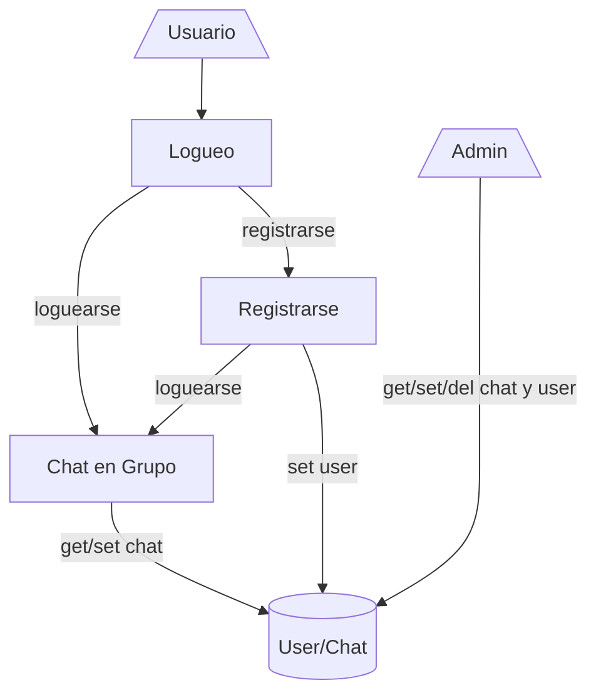

## Chat Real Time

Aplicación cliente-servidor, el cual simula un chat en tiempo real, donde se comunican usuarios en diferentes grupos ya armados. Utiliza **django** y **microservicios** para el funcionamiento del logueo de los usuarios y el chat en tiempo real.

## Gráfico de Arquitectura

  

 
- El usuario solo puedo escribir en el chat una ves logueado en el sistema.
- El usuario puede registrarse en caso de no tener cuenta.
- El admin es el encargado de administrar las base de datos mediante la interfaz de admin de **Django**, agregando o eliminando tanto usuarios como grupos de chat en el sistema.
- Tanto el microservicio Chat como el microservicio User utilizan la misma base de datos.