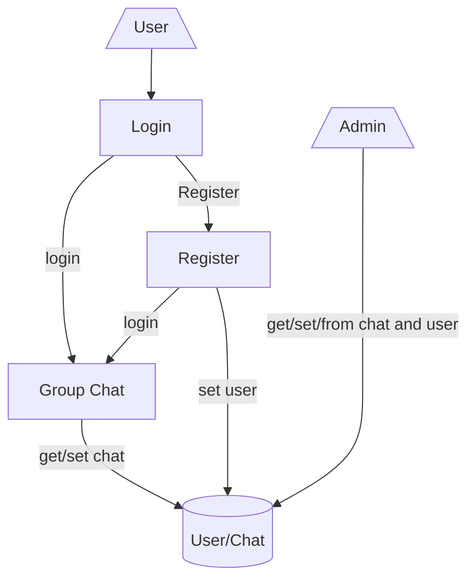

<h1 align="center"> Chatnet Hub </h1>

Client-server application, which simulates a chat in real time, where users communicate in different already armed groups. It uses **django** and **microservices** to run user login and real-time chat.

## About
Chatnet Hub is a Real-time Chat project designed by us as work for our university subject __Ingenieria de Software__.

* Used tools:

 
  
     

## Architecture Graphic

  

 
- The user can only write in the chat once logged into the system.
- The user can register in case of not having an account.
- The admin is in charge of managing the database through the **Django** admin interface, adding or removing both users and chat groups in the system.
- Both the Chat microservice and the User microservice use their own database.

#
Credits:
- Developers: 
     * [<i>Aaron Moya</i>](https://github.com/j0k3rD)
     * [<i>Nicolas Mayoral</i>](https://github.com/NKAmazing) 
     * [<i>Marcos Miglierina</i>](https://github.com/XxRaXoRxX)
     * [<i>Alexis Lino</i>](https://github.com/AlexSTM2)

- Instructor: Pablo Prats

- Institution: [<i>Universidad de Mendoza - Facultad de Ingenieria</i>](https://um.edu.ar/ingenieria/)

