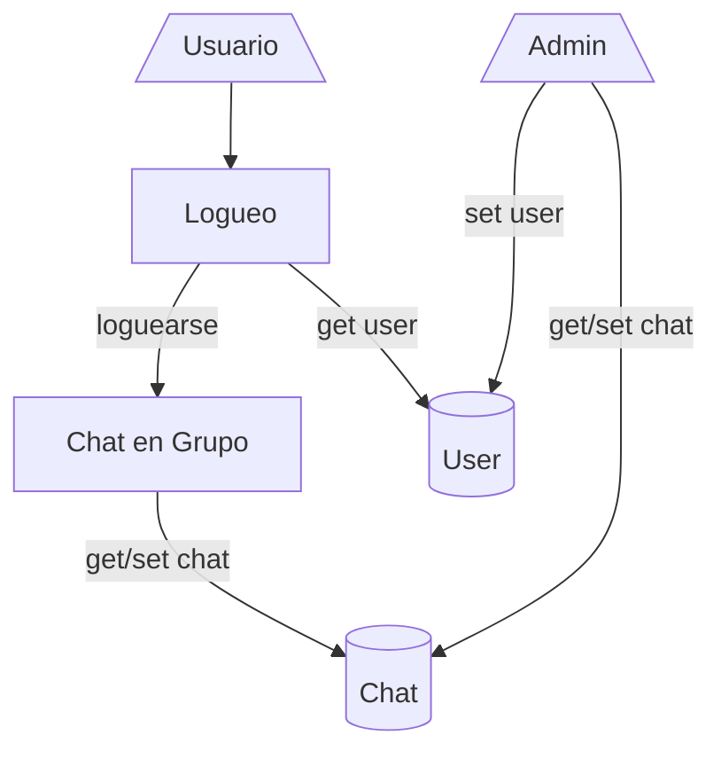

-# Chat Real Time
Aplicación cliente-servidor, el cual simula un chat en tiempo real, donde se comunican usuarios en diferentes grupos ya armados. Utiliza **django** y **microservicios** para el funcionamiento del logueo de los usuarios y el chat en tiempo real.
## Gráfico de Arquitectura

-- El usuario solo puedo escribir en el chat una ves logueado en el sistema.
- El admin es el encargado de generar los usuarios y administrar las base de datos mediante la interfaz de admin de **Django**.
- Django no tiene soporte para microservicio, por ese motivo se utilizan dos base de datos distintas, trabajando en dos microservicios diferentes, siendo este el logueo y chat.